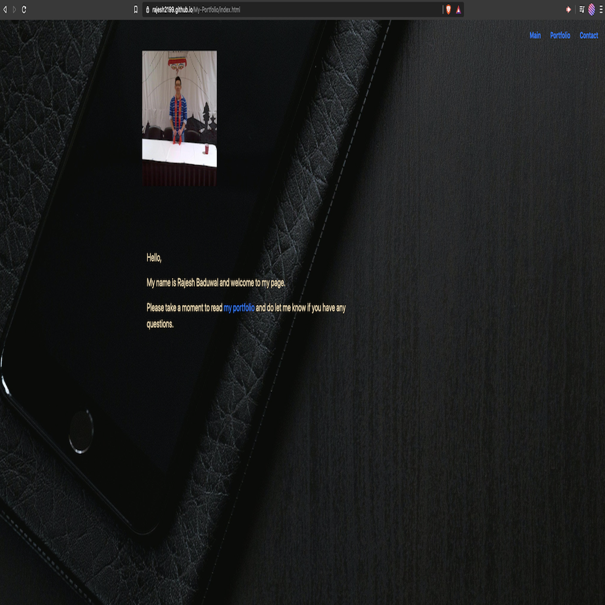

This repository contains codes and files that have used to create a portfolio website. The link to the site is https://rajesh2199.github.io/My-Portfolio/ and a screenshot is also attached to this readme file.
The aim of this project was to create a portolio from scratch using HTML ,CSS and Bootstrap properties. This being a very first project that I created from scratch, I have tried to make it very simple and concise. And as I gain more indepth knowledge on programming topics,I will periodically be coming back to this site and keeping making changes to add more functionality and to make it look more professional.

Index.html contains the main page of the website with all the necessary links. Similarly, portfolio.html serves as the page with bio details and Contact.html contains information required to submit any queries by users.On both Index.html and portfolio.html pages Bootstrap concepts such as grids, rows,columns and components have been properly utilized to make the website responsive on various screen sizes.And finally the nav-bar has been made consistent on each of the three pages.

